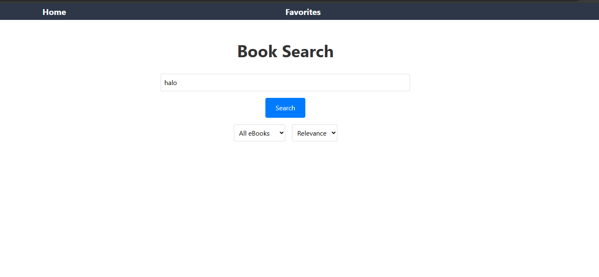
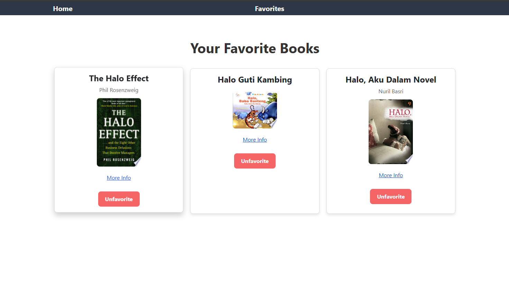
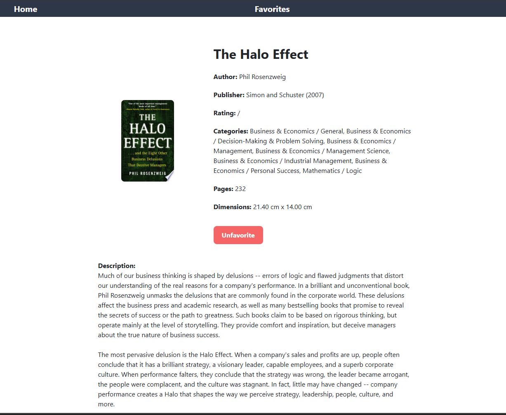

# Book Search App

## Overview

The Book Search App is a web application built with Next.js, React, and TypeScript that allows users to search for books, view book details, manage their favorite books, and more. It includes features like filtering, pagination, sorting, authentication, and localization.

https://trivenapanjaitan.github.io/CodeChallange2/





## Features

- **Book Search**: Search for books based on various criteria.
- **Book Details**: View detailed information about each book.
- **Favorites Management**: Save and manage favorite books.
- **Filtering**: Filter books based on criteria such as availability (e.g., free or paid eBooks).
- **Pagination**: Efficiently handle large sets of search results with pagination.
- **Sorting**: Sort search results by relevance or publication date.
- **Authentication** (Optional): Sign in/sign up to save favorite books across sessions.
- **Localization** (Optional): Support multiple languages for the interface.

## Technologies

- **Frontend**: Next.js, React, TypeScript
- **Styling**: Tailwind CSS, SCSS
- **API**: Google Books API
- **Testing**: Jest, React Testing Library

## File Structure

```plaintext
/.
├── public/
│   └── assets/
│       └── images/
├── src/
│   ├── components/
│   │   ├── BookCard.tsx
│   │   ├── FavoriteButton.tsx
│   │   ├── Header.tsx
│   │   └── Layout.tsx
│   ├── pages/
│   │   ├── _app.tsx
│   │   ├── index.tsx
│   │   ├── book.tsx
│   │   └── favorites.tsx
│   ├── styles/
│   │   ├── BookCard.module.scss
│   │   ├── BookDetail.module.scss
│   │   ├── FavoriteButton.module.scss
│   │   ├── Header.module.scss
│   │   └── HomePage.module.scss
│   └── utils/
│       ├── api.ts
│       └── favorites.ts
│   └── types/
│       └── book.ts
├── .eslintrc.json
├── .gitignore
├── next.config.mjs
├── package.json
├── postcss.config.js
├── tsconfig.json
└── tailwind.config.js
```

## Setup

1. **Clone the repository:**

   ```bash
   git clone https://github.com/TrivenaPanjaitan/CodeChallange2.git
   cd CodeChallange2
   ```

2. **Install dependencies:**

   ```bash
   npm install
   ```

3. **Set up environment variables:**

   Create a `.env.local` file in the root directory and add your Google Books API key:

   ```plaintext
   GOOGLE_BOOKS_API_KEY=yourAPIKey
   ```

4. **Run the development server:**

   ```bash
   npm run dev
   ```

   Open your browser and navigate to `http://localhost:3000` to view the application.

5. **Build and deploy:**

   To build the project for production:

   ```bash
   npm run build
   ```

   To export the static site and deploy to GitHub Pages:

   ```bash
   npm run deploy
   ```

## Unit Testing

To run unit tests:

```bash
npm test
```

## Optional Features

- **Authentication**: Implement user authentication to manage favorite books across sessions.
- **Localization**: Add support for multiple languages.

## License

This project is licensed under the MIT License. See the [LICENSE](LICENSE) file for details.

---

Feel free to adjust the content based on any additional details or specific instructions for your project.
